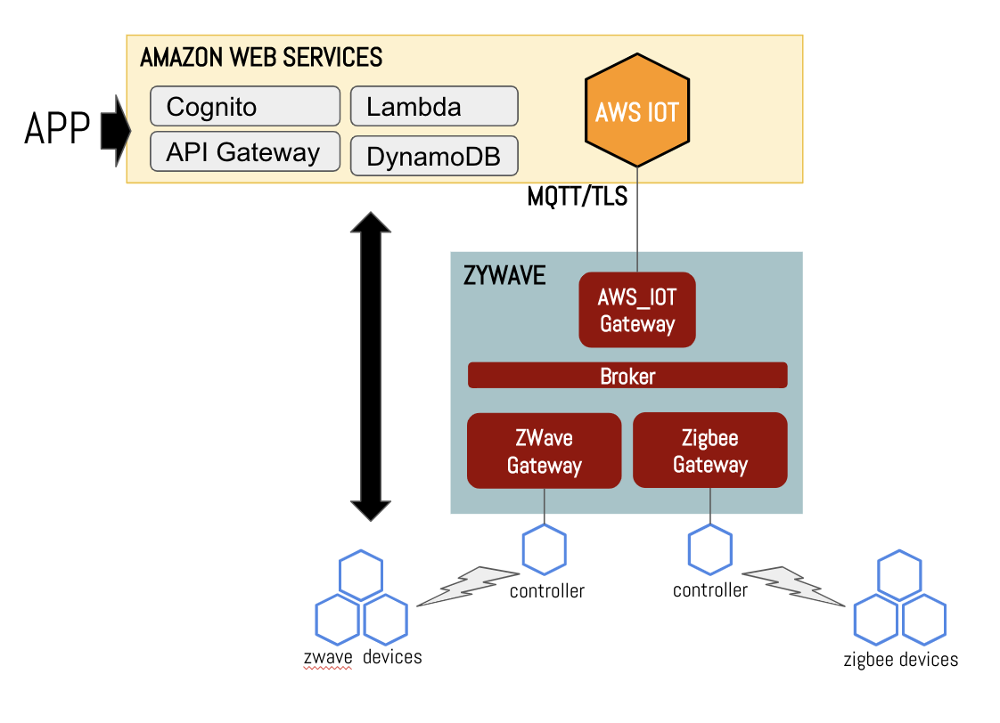

# zywave-gw

Python based application to integrate a zwave / zigbee with AWS IOT.  The main idea, see following image,  is to be able to control devices via AWS IOT and  sending device updates / reports to AWS IOT.  With this capability, one can developa  secure, scalable applications to enable remote access to devices.

## Version 1.0

The objective is to:
* Initiate Inclusion and removal from the network via JSON messages from AWS IOT.
* using **AEOTEC Z-Stick Gen 5**,  discover the devices on a zwave network and map the devices to AWS IOT’s Device Shadow 
* Control a switch device by sending ON and OFF command (i.e. publish a JSON message  on an AWS IOT Topuiv)

  